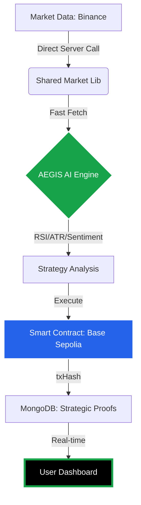

# 🛡️ AEGIS AI Strategy Engine

<p align="center">
  
</p>

<p align="center">
  <a href="https://sepolia.basescan.org/">
    
  </a>
  <a href="https://nextjs.org/">
    
  </a>
  <a href="https://ethers.org/">
    
  </a>
</p>

---

## 🌌 Overview
**AEGIS AI** không chỉ là một Dashboard Crypto; nó là một **Chiến thần Quản trị Rủi ro** hoạt động trên nền tảng AI và Blockchain. Dự án được thiết kế để mang lại sự an tâm tuyệt đối cho các nhà giao dịch thông qua các phân tích kỹ thuật chuẩn xác và minh bạch hóa 100% dữ liệu thực thi.

### 🧩 Kiến trúc Hệ thống (Workflow)



---

## ⚡ Tính Năng

| Tính năng | Chi tiết | Lợi ích |
| :--- | :--- | :--- |
| **AegisScore** | AI chấm điểm từ 0-100 | Quyết định vào lệnh khoa học |
| **Risk Guard** | Tự động tính SL/TP theo ATR | Bảo vệ vốn tuyệt đối |
| **On-chain Proof** | Ghi sổ cái Base Sepolia | Không thể gian lận dữ liệu |
| **Shimmer UI** | Hiệu ứng tải dữ liệu cao cấp | Trải nghiệm mượt mà, không giật lag |

---

## 🤖 AI Logic & Risk Management

Hệ thống sử dụng bộ 3 chỉ số vàng để đưa ra quyết định:
- **RSI (Relative Strength Index)**: Xác định vùng quá mua/quá bán.
- **ATR (Average True Range)**: Đo lường biến động để đặt Stop Loss thông minh.
- **Sentiment Analysis**: Phân tích tâm lý thị trường thời gian thực.

> [!TIP]
> **AegisScore > 60**: Tín hiệu Bullish mạnh mẽ - Ưu tiên lệnh Long.
> **AegisScore < 40**: Tín hiệu Bearish rõ rệt - Ưu tiên lệnh Short.

---

## 📂 Cấu trúc Dự án (Pro Layout)

```bash
OrinTee/
├── 📜 contracts/          # Smart Contracts (Solidity)
├── 📂 src/
│   ├── 📂 app/            # Next.js App Router (UI & API)
│   ├── 📂 components/     # UI Components (Premium UI)
│   ├── 📂 hooks/          # Web3 & Logic Hooks (Pure Ethers)
│   ├── 📂 lib/            # Shared Library (Binance, Utils)
│   ├── 📂 models/         # MongoDB Schemas
│   └── 📂 store/          # Global State (Zustand)
├── 🐳 docker-compose.yml  # Production Orchestration
└── ⚙️ vercel.json         # Automated PnL Cron Config
```

---

## 🚀 Cài Đặt Trong 1 Phút

1. **Clone dự án & Cài đặt**:
   ```bash
   git clone https://github.com/lephambinh05/orintee-AEGIS-AI.git
   npm install
   ```

2. **Cấu hình môi trường**:
   Copy file `.env.example` thành `.env` và điền các Key bí mật của bạn.

3. **Chạy ứng dụng**:
   ```bash
   npm run dev
   ```

---

## 🛡️ Bảo Mật & Tối Ưu
Hệ thống được thiết kế với tư duy **Security First**:
- **CORS Restricted**: Chống gọi API "lậu".
- **Self-fetching Fix**: Chống treo Server (Deadlock).
- **Safe BigInt**: Chính xác tuyệt đối từng đơn vị WEI.

---
<p align="center">
  Phát triển với ❤️ bởi <b>ORINTEE</b> with loveee <br/>
  <i>"Nâng tầm giao dịch bằng công nghệ AI và Blockchain"</i>
</p>